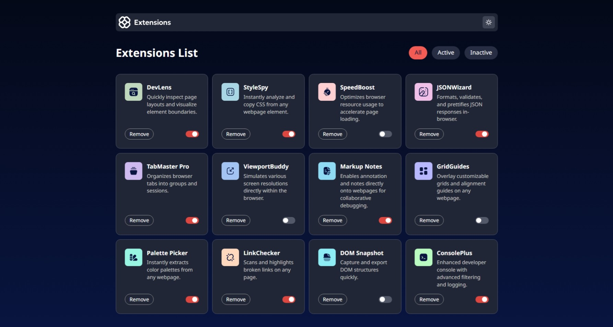

# Frontend Mentor - Browser extensions manager UI solution

This is a solution to the [Browser extensions manager UI challenge on Frontend Mentor](https://www.frontendmentor.io/challenges/browser-extension-manager-ui-yNZnOfsMAp). Frontend Mentor challenges help you improve your coding skills by building realistic projects.

## Table of contents

- [Overview](#overview)
  - [The challenge](#the-challenge)
  - [Screenshot](#screenshot)
  - [Links](#links)
- [My process](#my-process)
  - [Built with](#built-with)
  - [What I learned](#what-i-learned)
  - [Continued development](#continued-development)
- [Author](#author)

## Overview

### The challenge

Users should be able to:

- Toggle extensions between active and inactive states
- Filter active and inactive extensions
- Remove extensions from the list
- Select their color theme
- View the optimal layout for the interface depending on their device's screen size
- See hover and focus states for all interactive elements on the page

### Screenshot

### Links

- Solution URL: [https://github.com/uptowngirl757/extensions-manager](https://github.com/uptowngirl757/extensions-manager)
- Live Site URL: [https://extensions-manager-wine.vercel.app/](https://extensions-manager-wine.vercel.app/)

## My process

### Built with

- Semantic HTML5 markup
- CSS custom properties
- Flexbox
- CSS Grid
- Mobile-first workflow
- [React](https://reactjs.org/) - JS library

### What I learned

This was my first project implementing light and dark mode functionality. Through this experience, I gained hands-on understanding of how to manage theme switching using React's state management system. While I initially attempted to use Tailwind's built-in dark mode utilities, I found React's state approach more intuitive for my current understanding.

### Continued development

Moving forward, I want to deepen my knowledge of Tailwind's dark mode implementation. I opted for React state management in this project, but I'd like to explore Tailwind's native approach to better understand its advantages and when each method is most appropriate. This will help me choose the best solution for future projects.

## Author

- Frontend Mentor - [@uptowngirl757](https://www.frontendmentor.io/profile/uptowngirl757)
